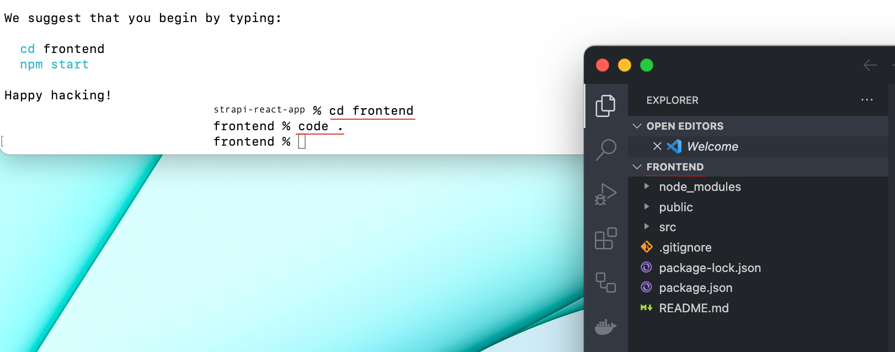
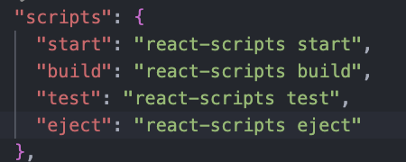
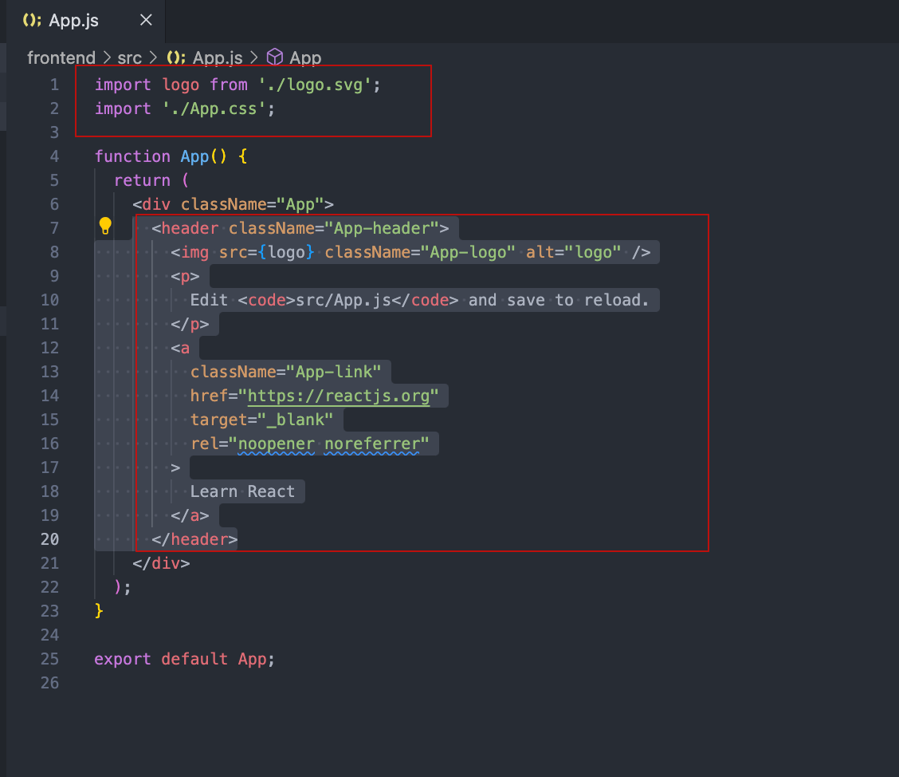
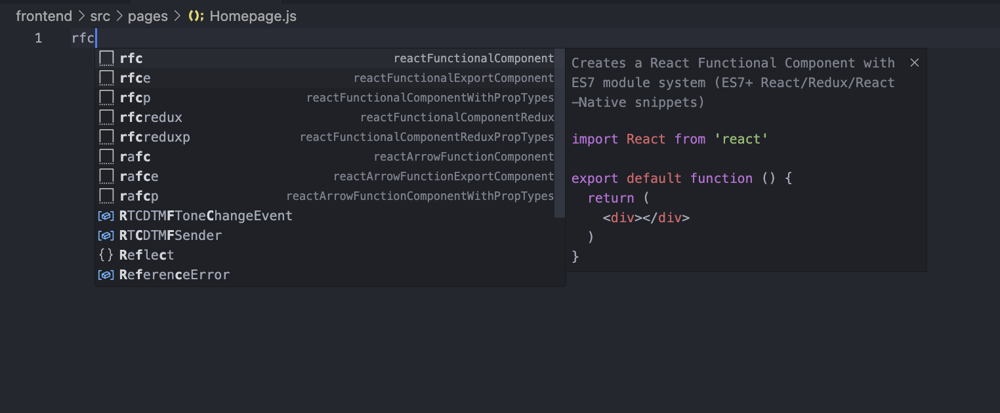
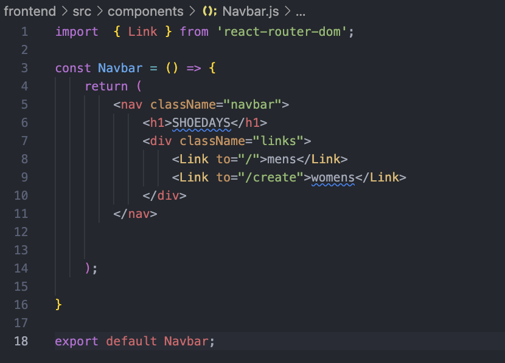
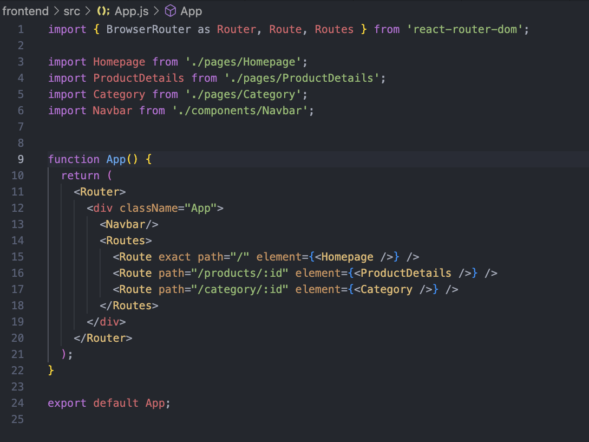
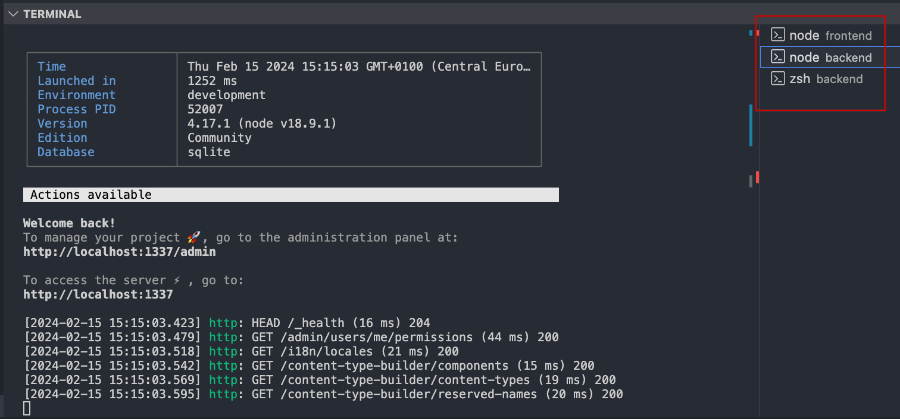

## Introduction
In this tutorial, we'll cover the creation of a RESTful API with Strapi and its integration with a React frontend.

Strapi simplifies the setup of RESTful APIs, facilitating seamless communication between backend and frontend. By following this guide, you'll learn to efficiently fetch backend data, leverage Strapi's RESTful endpoints, and display content on a React frontend.

We'll begin by creating RESTful API endpoints using Strapi. It's important to note that the first part of the walkthrough is nearly identical to the one provided in the Strapi case study, authored by the same individual responsible for this case study. Additionally, the author of this case study has developed a basic demo app called 'Shoedays' only for this purpose.This app's straightforward design serves as a demonstration for this case study, focusing on two key phases: backend integration and frontend.

    Backend Integration: We'll leverage Strapi to establish RESTful API endpoints for each product. This entails configuring Strapi to manage our data and expose APIs for interaction.

    Frontend Integration: Utilizing React as our frontend framework, we'll fetch, render, and display products from the API endpoints.

Throughout this tutorial, we'll work with various tools and programs:

    Terminal: We'll install and configure Strapi and React.

    VSCode: We'll use this to create separate backend and frontend projects.

    Strapi Admin Panel: This interface will assist us in creating endpoints with a RESTful API.

    Postman: We'll employ Postman to test our API endpoints.

    React: Our frontend framework.

This case study is not delving too deeply into Strapi or React concepts, as you can refer to the respective case studies for more in-depth knowledge. 

### Goal of this tutorial
The goal of this case study is to guide you through the integration of Strapi with React. Please note that while this tutorial covers the setup of the 'Shoedays' demo app, the focus is not on the responsiveness or styling of the app itself, but rather on creating endpoints for our products and fetching them in our demo application. 

## Backend set up with Strapi

### Strapi set up using the Quickstart option
Through Strapi's Quickstart option, we'll swiftly install Strapi and proceed to define dedicated endpoints for each product in the ShoeDays inventory. This walkthrough provides a hands-on experience in Strapi's efficiency for API development.

### Installing Strapi with the terminal
1. Begin by opening your terminal and navigating to the directory where you intend to install your project.

2. Once in the desired directory, create a new folder for your project using the 'mkdir' command followed by the desired name. In this demo we will call the project folder 'strapi-react-app'. 

3. Create a strapi project by typing 'npx create-strapi-app' and name the project 'backend'.

4. Initiate the creation of a Strapi project by executing the command 'npx create-strapi-app' and specifying the project name as 'backend'.

5. Upon completion, Strapi will automatically launch a local development server. Access the Strapi welcome page via your web browser and proceed to authenticate as an admin user. 

6. Once authenticated, return to your terminal and terminate the local server by pressing 'ctrl + C'. Then, navigate into the 'backend' folder and open it in VS Code using the command 'code .'.

7. To restart the server and regain access to the Strapi admin panel, open a new terminal window in VSCode and execute the command 'npm run develop'.

### Adding content in Strapi to fetch API endpoints
1. Within the Strapi admin panel, navigate to 'Plugins' > 'Content-Types Builder'.
Content-Type-Builder: is a blueprint for the content describing the contents fields and datatypes.

2. Click on 'Create new Collection type' to initiate the creation of a new content type.

3. Next, select "Add another field to this collection type" to begin defining the fields for your collection.

4. Begin by adding fields that capture relevant information about each shoe product, such as Name ('Text' field), Description ('Text' field), Price ('Number' field), Gender ('Enumeration' field), and Image ('Media' field).

5. Add the 'Name' field with the type 'Short text'.

6. Configure the advanced settings by setting a default value, marking it as a required field, and making it unique.

7. Proceed to add the 'Description' field with the type 'Long text'.

8. 	Add an 'Enumeration field' named 'Gender' and define its values.

9. Configure the advanced settings for the 'Gender' field by setting a default value, such as 'Unisex'.

10. Include a 'Media' field named 'Image' with the type 'Multiple media'.

11. Specify the allowed types of media in the 'Advanced settings' for the 'Image' field.

12. Add a 'Number' field named 'Price' with the number format set to 'Decimal'.

13. Once all fields are configured, save the collection type. Strapi will automatically save and refresh the server. To access the newly created collection type, navigate to 'Content Manager' > 'Collection Types' > 'product' on the Strapi Dashboard.

### Creating products with Custom Fields

1. Now, let's proceed to create products using our custom set fields.

2. Fill in the required fields such as name(*), description, gender, price, and image. Don't forget to add Alternative text for the image.

3. 	Once all product details are entered, proceed to save the entry.

Now that we've set up our products with attributes such as ID, name, description, gender, price, and image, they are prepared to be fetched, rendered, and displayed on the frontend using React.

When we established a new 'Content-type' for our products, Strapi automatically generated an endpoint to access our backend project and created the 'product' folder within the API directory. Inside this folder, we can locate the API controllers and routes in the src/api directory.

## Summary and Next steps
With our backend up and running, we can fetch data via Strapi's REST API endpoints and test them using Postman. Now, we'll pivot to building the frontend of our fictitious e-commerce app.

Here's a quick rundown of our next steps:

    Create a Repository on GitHub: We'll start by setting up a GitHub repository for our project.

    Set Up Development Servers: We'll use react-scripts start for our frontend and a separate server for our Strapi backend. 

## Frontend integration with React
In this part of the case study, we'll cover how to fetch the product endpoints we created in Strapi using React and display them on the demo app 'Shoedays.' This section won't delve into the basics of React, as those are covered in the existing React case study. Due to the length constraints of the case study, we'll focus solely on a walkthrough of fetching all the products from Strapi, excluding relational data. For this part, we'll utilize tools such as the terminal for creating a project directory for the frontend, VSCode, Strapi and Postman for testing purposes.

### Setting Up the Frontend Environment: Initial Steps
1. Navigate to the project directory named 'strapi-react-app' in your terminal, where the 'backend' folder is installed.

2. Change directory into the 'frontend' folder and open it in VSCode using the command 'code .'

3. Create a new branch from the 'main' branch as the working branch. For example, name it 'dev' for the development branch.

4. Install React Scripts by running the command npm install react-scripts in the Git CLI. This installs the necessary scripts and configurations for developing and building React applications.

5. Check the available scripts commands in your package.json file. During development, you'll often want to preview the web application in a browser.

    To start the local development server, run: npm run start

6. Clean Up the Project Setup and delete the following files:
            
- src/App.css: As all CSS will be stored in the index.css folder.
- src/App.test.js: Testing will not be covered in this demonstration.
- src/logo.svg: The React logo is unnecessary.
- reportWebVitals.js: Web vitals reporting will not be covered in this demo.
- setupTest.js: Jest environment testing will not be covered in this demo.

7. Remove all imports inside App.js as we deleted these files, and remove the content within the "header" tag.

8. Install the extension: ES/React/Redux/GraphQL/React-Native snippets to access React.js snippets.

9. Create two new folders in the src folder:

- Components: For Navbar.js.

- Pages: For Category.js, Homepage.js, and ProductDetails.js. Only Homepage and ProductDetails will be covered; Category is for relational data and will not be addressed.

10. After installing the ES7 React extension, utilize React snippets for each page. To begin, type 'rfc' (short for React functional component) at the top of the page and press enter. This will create a React Functional Component and automatically import React from 'react'.

### Creating the Navbar
For the components, we'll begin by creating the navbar, which will be displayed at the top of every page. Please note that this walkthrough will not include specific styling, as the demo app does not focus on design or UX.

1. To enable the use of URL link tags in React, we need to install React Router DOM, which also allows us to set up routes inside the root.

2. Create a new file named Navbar.js in the components folder and type 'rfc' followed by Enter.

- Insert the className 'navbar'.
- Set up a link to the homepage to establish the link until we set up the router.

###  Setting up the Routes
Now that React Router DOM is installed, we can proceed to set up the routes for the pages inside the App.js file.

1. Import these files into App.js:
- BrowserRouter from react-router-dom.
- All our created .js pages, including the Navbar, from the components folder.
- Configure the router accordingly.

### Working Simultaneously with Frontend and Backend
To streamline development, we will divide the terminal into three sections:

- node Backend: Running Strapi on a separate port.
- node Frontend: Running the React framework on a separate port.
- Zsh Backend: This terminal is dedicated to backend operations, where we will continuously save commits.

To navigate between the frontend and backend directories in the terminal, use 'cd ..' to return to the root of the strapi-react-app project, then use 'cd' followed by the folder name to enter either the frontend or backend folder.

The structure of the strapi-react-app project includes a backend folder connected to Strapi, where the Collection type Product we recently created is stored inside the src/api folder and managed by Strapi. Additionally, there's a frontend folder connected to React.

